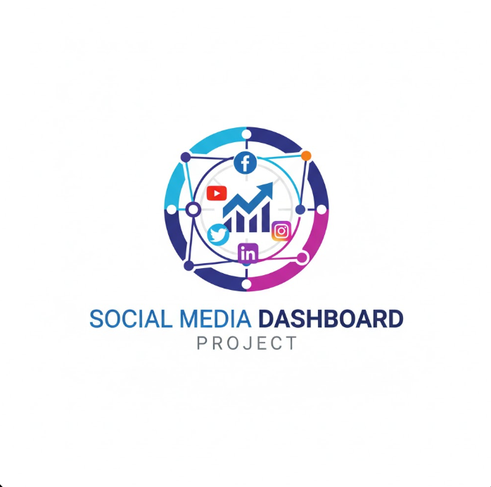

# MEGO — Personal Portfolio

Live demo: (add your live site URL here)

Short: A responsive, multilingual developer portfolio built with React and Vite showcasing projects, skills, experience, and contact information.

---

## Showcase

Add a screenshot or GIF of the site in `assets/images/` and reference it here:



---

## Key Highlights

- Clean responsive design with Light/Dark theme
- Arabic and English language support
- Animated UI: typing effect, particle background, counters
- Project filtering, modals, and lightbox for certificates
- Accessible components and keyboard-friendly navigation

## Built With

- React
- Vite
- Vanilla CSS (single `src/style.css`)

## Usage

Run locally:

```bash
npm install
npm run dev
```

Build:

```bash
npm run build
npm run preview
```

## How to Customize

- Update content: edit `src/data.js` to change name, bio, skills, projects, and certifications.
- Replace images: add your photos and assets to `src/assets/images/` and update paths in `src/data.js` or components.
- Styling: modify `src/style.css` to change colors, spacing, or typography.

## Add a Live Demo Link

If you deploy the site (Vercel/Netlify/GitHub Pages), add the URL under "Live demo" at the top. Example:

Live demo: https://your-username.github.io/portfolio-react

## Contributing & Feedback

Contributions are welcome. Open an issue or submit a pull request with improvements.

## Contact

Use the contact form in the site, or add your email and social links here.

---

If you want, I can:

- Add social badges and a live-demo link
- Add an autogenerated `README.md` hero with your name and short intro
- Add a screenshot file and wire it into the README

File updated: [portfolio-react/README.md](portfolio-react/README.md)
